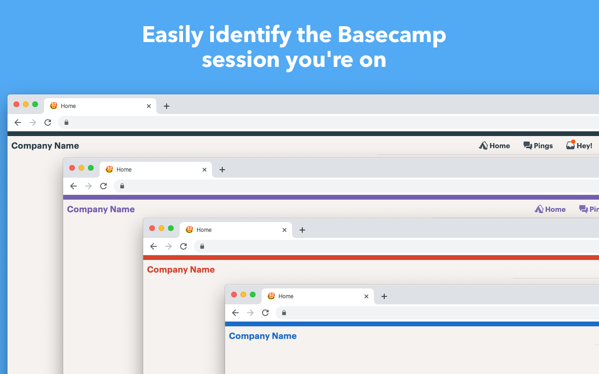

# ⛰ Basecamp Enhancer

A Google Chrome extension to super power your Basecamp 3 experience

## 🖼 Screenshots

## 🧾 Functionality
- [x] Adds a bordered bar to the top of your screen themed to your Basecamp selection
- [x] Swaps out the generic Basecamp logo with the company name
- [x] Make the toolbar sticky as the user scrolls the page

## 📦 Installing

### ✅ Stable from Chrome Web Store
[The Chrome Web Store](https://chrome.google.com/webstore/detail/basecamp-enhancer/hllgadpbecmjmfbjpclnjhlppanhalmk) contains the latest stable version of the extension.

### 🐞 Beta from GitHub
You can optionally run the beta by directly installing the extension within Chrome. To install:

1. Download [the zip of the project](https://github.com/aaronbushnell/basecamp-enhancer/archive/master.zip)
2. Unzip the project (but do not delete the folder after finishing the install; Chrome continues to read from this location)
3. Navigate your browser to the [Extensions](chrome://extensions/) panel `chrome://extensions/`
4. Turn on "Developer mode"
5. Drag the unzipped folder to the window and allow Chrome to finish the installation
